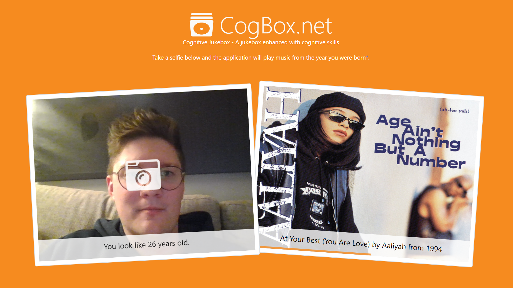

# CogBox.net - A jukebox enhanced with cognitive skills

[](https://twitter.com/PeterOrneholm)

Some time ago, we at [Active Solution](https://www.activesolution.se/) arranged an internal Hackathon with focus on music and modern web technologies. Me myself decided I wanted to see how I could combine AI and music from Spotify - and then Cognitive Jukebox was born!

## Introducing Cognitive Jukebox

CogBox.net is a jukebox enhanced with cognitive skills. Take a selfie and the application will play music from the year you were born.



The application is built using modern web technologies, AI services in Azure and music from Spotify.

### Frontend

Using [Javascript](https://developer.mozilla.org/en-US/docs/Web/API/MediaDevices/getUserMedia) the stream from the webcam is captured and once the user takes a photo it's sent to the ASP.NET Core backend.

```javascript
navigator.mediaDevices.getUserMedia({
    audio: false,
    video: {
        facingMode: { exact: "user" }
    }
}).then(function (mediaStream) {
    videoElement.srcObject = mediaStream;
});
```

### Age detection

The backend forwards the image to [Cognitive Services in Azure](https://azure.microsoft.com/en-us/services/cognitive-services/). Using the [Face API](https://azure.microsoft.com/en-us/services/cognitive-services/face/) we can extract information such as estimated age, emotions, gender etc. In this case we focus on the estimated Age.

```csharp
var analyzeImageResult = await _computerVisionClient.AnalyzeImageInStreamAsync(file.OpenReadStream(), new List<VisualFeatureTypes>
{
    VisualFeatureTypes.Description,
    VisualFeatureTypes.Faces
});
var age = analyzeImageResult.Faces.First().Age;
```

### Spotify Music

Given that age, we can figure out the year of birth of the user. Spotify allows us to filter music by year, so the [Spotify Web API](https://developer.spotify.com/documentation/web-api/) can then be used to get some top tracks from that year. The OSS lib [SpotifyAPI-NET](https://github.com/JohnnyCrazy/SpotifyAPI-NET) made it very easy to consume from .NET.

```csharp
var searchItems = api.SearchItems("year:" + year, SearchType.Track);
var mp3Url = searchItems.Tracks.Items.First().PreviewUrl;
```

## Cost

There are a few basic costs involved. But the part that could become expensive is the analytics of images. I've estimated it to cost roughly *$1 USD / 1000 images* analyzed.

The Spotify Web API is free to use, but comes with rate limits. If I hit those, the site would require the user to login and use their own account.

## Interested in even more details?

If you or your company wants to know more about services like this, I deliver a session/Workshop called "[Democratizing AI with Azure Cognitive Services](http://bit.ly/peterorneholm-democratizing-ai)" which shows the potential of Cognitive Services by fun and creative examples. Please drop me an email if that sounds interesting.

## Summary

This site brings zero to no value, but it was a fun way of exploring a few technologies and maybe it will give a smile to those who uses it :)

I've published all the [source code to GitHub](https://github.com/PeterOrneholm/CogBox.net) and the dockerimage that powers the site is [available at DockerHub](https://hub.docker.com/r/peterorneholm/orneholmcognitivejukeboxweb).

If you like it, please share it with friends and family. I've noticed that people like it the most when it subtracts a few years from your age.... :)

Any feedback or cheers is always welcome, I'm [@PeterOrneholm](https://twitter.com/PeterOrneholm) at Twitter.
